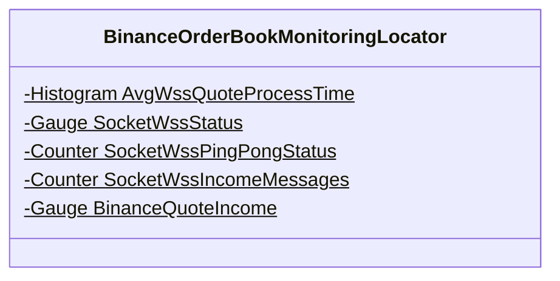
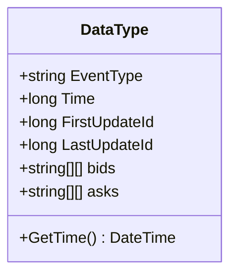
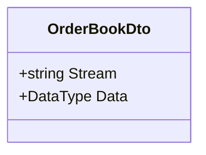
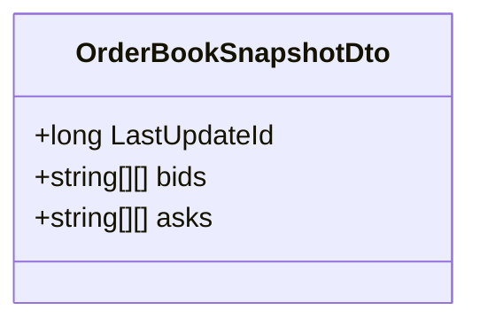
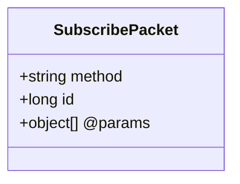
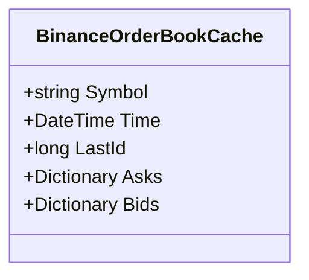
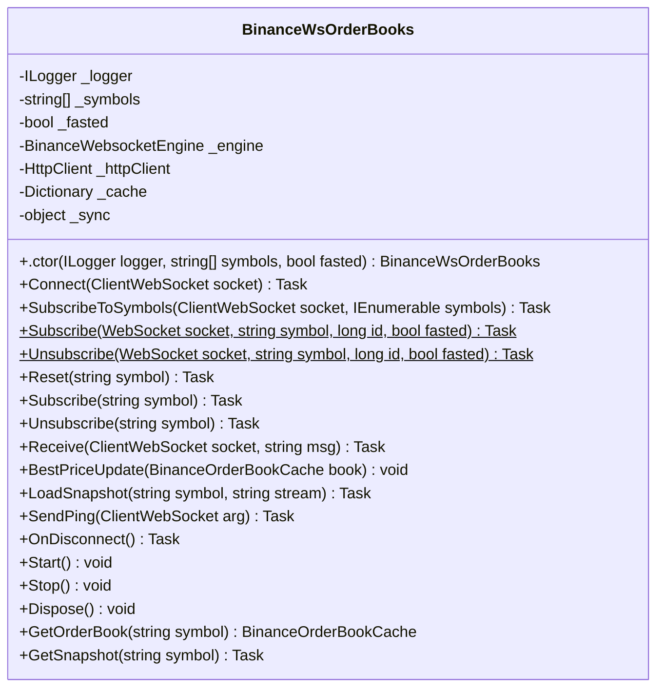
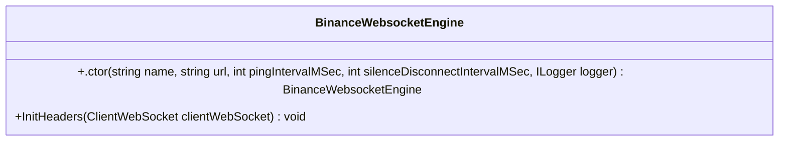
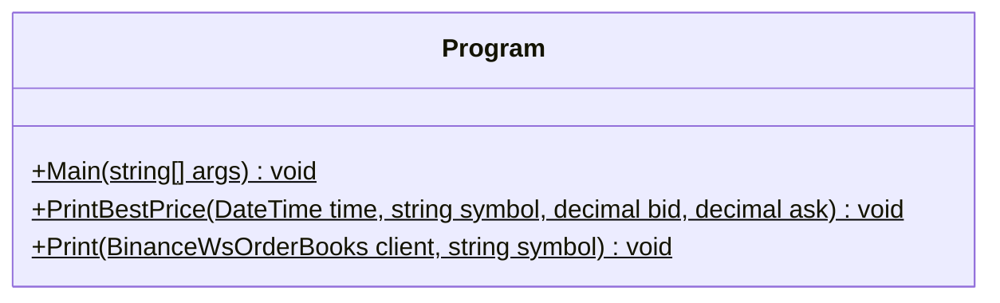

<!-- markdownlint-capture -->
<!-- markdownlint-disable -->

# Code Metrics

This file is dynamically maintained by a bot, *please do not* edit this by hand. It represents various [code metrics](https://aka.ms/dotnet/code-metrics), such as cyclomatic complexity, maintainability index, and so on.

## MyJetWallet.Connector.Binance :exploding_head:

The *MyJetWallet.Connector.Binance.csproj* project file contains:

- 4 namespaces.
- 8 named types.
- 455 total lines of source code.
- Approximately 145 lines of executable code.
- The highest cyclomatic complexity is 15 :exploding_head:.

  <strong id="myjetwallet-connector-binance">
    MyJetWallet.Connector.Binance :heavy_check_mark:
  </strong>

 

The `MyJetWallet.Connector.Binance` namespace contains 1 named types.

- 1 named types.
- 28 total lines of source code.
- Approximately 3 lines of executable code.
- The highest cyclomatic complexity is 0 :heavy_check_mark:.

  <strong id="binanceorderbookmonitoringlocator">
    BinanceOrderBookMonitoringLocator :heavy_check_mark:
  </strong>

 

- The `BinanceOrderBookMonitoringLocator` contains 5 members.
- 25 total lines of source code.
- Approximately 3 lines of executable code.
- The highest cyclomatic complexity is 0 :heavy_check_mark:.

| Member kind | Line number | Maintainability index | Cyclomatic complexity | Depth of inheritance | Class coupling | Lines of source / executable code |
| :-: | :-: | :-: | :-: | :-: | :-: | :-: |
| Field | <a href='https://github.com/MyJetWallet/MyJetWallet.Connector.Binance/blob/master/src/MyJetWallet.Connector.Binance/MonitoringLocator.cs#L7' title='Histogram BinanceOrderBookMonitoringLocator.AvgWssQuoteProcessTime'>7</a> | 91 | 0 :heavy_check_mark: | 0 | 2 | 2 / 1 |
| Field | <a href='https://github.com/MyJetWallet/MyJetWallet.Connector.Binance/blob/master/src/MyJetWallet.Connector.Binance/MonitoringLocator.cs#L23' title='Gauge BinanceOrderBookMonitoringLocator.BinanceQuoteIncome'>23</a> | 87 | 0 :heavy_check_mark: | 0 | 3 | 5 / 1 |
| Field | <a href='https://github.com/MyJetWallet/MyJetWallet.Connector.Binance/blob/master/src/MyJetWallet.Connector.Binance/MonitoringLocator.cs#L19' title='Counter BinanceOrderBookMonitoringLocator.SocketWssIncomeMessages'>19</a> | 91 | 0 :heavy_check_mark: | 0 | 2 | 2 / 1 |
| Field | <a href='https://github.com/MyJetWallet/MyJetWallet.Connector.Binance/blob/master/src/MyJetWallet.Connector.Binance/MonitoringLocator.cs#L15' title='Counter BinanceOrderBookMonitoringLocator.SocketWssPingPongStatus'>15</a> | 91 | 0 :heavy_check_mark: | 0 | 2 | 2 / 1 |
| Field | <a href='https://github.com/MyJetWallet/MyJetWallet.Connector.Binance/blob/master/src/MyJetWallet.Connector.Binance/MonitoringLocator.cs#L11' title='Gauge BinanceOrderBookMonitoringLocator.SocketWssStatus'>11</a> | 91 | 0 :heavy_check_mark: | 0 | 2 | 2 / 1 |

<a href="#BinanceOrderBookMonitoringLocator-class-diagram">:link: to `BinanceOrderBookMonitoringLocator` class diagram</a>

<a href="#myjetwallet-connector-binance">:top: back to MyJetWallet.Connector.Binance</a>

  <strong id="myjetwallet-connector-binance-ws-models">
    MyJetWallet.Connector.Binance.Ws.Models :heavy_check_mark:
  </strong>

 

The `MyJetWallet.Connector.Binance.Ws.Models` namespace contains 4 named types.

- 4 named types.
- 58 total lines of source code.
- Approximately 23 lines of executable code.
- The highest cyclomatic complexity is 2 :heavy_check_mark:.

  <strong id="orderbookdto-datatype">
    OrderBookDto.DataType :heavy_check_mark:
  </strong>

 

- The `OrderBookDto.DataType` contains 7 members.
- 25 total lines of source code.
- Approximately 13 lines of executable code.
- The highest cyclomatic complexity is 2 :heavy_check_mark:.

| Member kind | Line number | Maintainability index | Cyclomatic complexity | Depth of inheritance | Class coupling | Lines of source / executable code |
| :-: | :-: | :-: | :-: | :-: | :-: | :-: |
| Property | <a href='https://github.com/MyJetWallet/MyJetWallet.Connector.Binance/blob/master/src/MyJetWallet.Connector.Binance/Ws/Models/SubscribePacket.cs#L40' title='string[][] DataType.asks'>40</a> | 100 | 2 :heavy_check_mark: | 0 | 1 | 2 / 2 |
| Property | <a href='https://github.com/MyJetWallet/MyJetWallet.Connector.Binance/blob/master/src/MyJetWallet.Connector.Binance/Ws/Models/SubscribePacket.cs#L37' title='string[][] DataType.bids'>37</a> | 100 | 2 :heavy_check_mark: | 0 | 1 | 2 / 2 |
| Property | <a href='https://github.com/MyJetWallet/MyJetWallet.Connector.Binance/blob/master/src/MyJetWallet.Connector.Binance/Ws/Models/SubscribePacket.cs#L25' title='string DataType.EventType'>25</a> | 100 | 2 :heavy_check_mark: | 0 | 1 | 2 / 2 |
| Property | <a href='https://github.com/MyJetWallet/MyJetWallet.Connector.Binance/blob/master/src/MyJetWallet.Connector.Binance/Ws/Models/SubscribePacket.cs#L31' title='long DataType.FirstUpdateId'>31</a> | 100 | 2 :heavy_check_mark: | 0 | 1 | 2 / 2 |
| Method | <a href='https://github.com/MyJetWallet/MyJetWallet.Connector.Binance/blob/master/src/MyJetWallet.Connector.Binance/Ws/Models/SubscribePacket.cs#L42' title='DateTime DataType.GetTime()'>42</a> | 100 | 1 :heavy_check_mark: | 0 | 2 | 4 / 1 |
| Property | <a href='https://github.com/MyJetWallet/MyJetWallet.Connector.Binance/blob/master/src/MyJetWallet.Connector.Binance/Ws/Models/SubscribePacket.cs#L34' title='long DataType.LastUpdateId'>34</a> | 100 | 2 :heavy_check_mark: | 0 | 1 | 2 / 2 |
| Property | <a href='https://github.com/MyJetWallet/MyJetWallet.Connector.Binance/blob/master/src/MyJetWallet.Connector.Binance/Ws/Models/SubscribePacket.cs#L28' title='long DataType.Time'>28</a> | 100 | 2 :heavy_check_mark: | 0 | 1 | 2 / 2 |

<a href="#OrderBookDto.DataType-class-diagram">:link: to `OrderBookDto.DataType` class diagram</a>

<a href="#myjetwallet-connector-binance-ws-models">:top: back to MyJetWallet.Connector.Binance.Ws.Models</a>

  <strong id="orderbookdto">
    OrderBookDto :heavy_check_mark:
  </strong>

 

- The `OrderBookDto` contains 2 members.
- 36 total lines of source code.
- Approximately 4 lines of executable code.
- The highest cyclomatic complexity is 2 :heavy_check_mark:.

| Member kind | Line number | Maintainability index | Cyclomatic complexity | Depth of inheritance | Class coupling | Lines of source / executable code |
| :-: | :-: | :-: | :-: | :-: | :-: | :-: |
| Property | <a href='https://github.com/MyJetWallet/MyJetWallet.Connector.Binance/blob/master/src/MyJetWallet.Connector.Binance/Ws/Models/SubscribePacket.cs#L20' title='DataType OrderBookDto.Data'>20</a> | 100 | 2 :heavy_check_mark: | 0 | 2 | 2 / 2 |
| Property | <a href='https://github.com/MyJetWallet/MyJetWallet.Connector.Binance/blob/master/src/MyJetWallet.Connector.Binance/Ws/Models/SubscribePacket.cs#L17' title='string OrderBookDto.Stream'>17</a> | 100 | 2 :heavy_check_mark: | 0 | 1 | 2 / 2 |

<a href="#OrderBookDto-class-diagram">:link: to `OrderBookDto` class diagram</a>

<a href="#myjetwallet-connector-binance-ws-models">:top: back to MyJetWallet.Connector.Binance.Ws.Models</a>

  <strong id="orderbooksnapshotdto">
    OrderBookSnapshotDto :heavy_check_mark:
  </strong>

 

- The `OrderBookSnapshotDto` contains 3 members.
- 11 total lines of source code.
- Approximately 6 lines of executable code.
- The highest cyclomatic complexity is 2 :heavy_check_mark:.

| Member kind | Line number | Maintainability index | Cyclomatic complexity | Depth of inheritance | Class coupling | Lines of source / executable code |
| :-: | :-: | :-: | :-: | :-: | :-: | :-: |
| Property | <a href='https://github.com/MyJetWallet/MyJetWallet.Connector.Binance/blob/master/src/MyJetWallet.Connector.Binance/Ws/Models/SubscribePacket.cs#L60' title='string[][] OrderBookSnapshotDto.asks'>60</a> | 100 | 2 :heavy_check_mark: | 0 | 1 | 2 / 2 |
| Property | <a href='https://github.com/MyJetWallet/MyJetWallet.Connector.Binance/blob/master/src/MyJetWallet.Connector.Binance/Ws/Models/SubscribePacket.cs#L57' title='string[][] OrderBookSnapshotDto.bids'>57</a> | 100 | 2 :heavy_check_mark: | 0 | 1 | 2 / 2 |
| Property | <a href='https://github.com/MyJetWallet/MyJetWallet.Connector.Binance/blob/master/src/MyJetWallet.Connector.Binance/Ws/Models/SubscribePacket.cs#L54' title='long OrderBookSnapshotDto.LastUpdateId'>54</a> | 100 | 2 :heavy_check_mark: | 0 | 1 | 2 / 2 |

<a href="#OrderBookSnapshotDto-class-diagram">:link: to `OrderBookSnapshotDto` class diagram</a>

<a href="#myjetwallet-connector-binance-ws-models">:top: back to MyJetWallet.Connector.Binance.Ws.Models</a>

  <strong id="subscribepacket">
    SubscribePacket :heavy_check_mark:
  </strong>

 

- The `SubscribePacket` contains 3 members.
- 6 total lines of source code.
- Approximately 0 lines of executable code.
- The highest cyclomatic complexity is 2 :heavy_check_mark:.

| Member kind | Line number | Maintainability index | Cyclomatic complexity | Depth of inheritance | Class coupling | Lines of source / executable code |
| :-: | :-: | :-: | :-: | :-: | :-: | :-: |
| Property | <a href='https://github.com/MyJetWallet/MyJetWallet.Connector.Binance/blob/master/src/MyJetWallet.Connector.Binance/Ws/Models/SubscribePacket.cs#L10' title='long SubscribePacket.id'>10</a> | 100 | 2 :heavy_check_mark: | 0 | 0 | 1 / 0 |
| Property | <a href='https://github.com/MyJetWallet/MyJetWallet.Connector.Binance/blob/master/src/MyJetWallet.Connector.Binance/Ws/Models/SubscribePacket.cs#L9' title='string SubscribePacket.method'>9</a> | 100 | 2 :heavy_check_mark: | 0 | 0 | 1 / 0 |
| Property | <a href='https://github.com/MyJetWallet/MyJetWallet.Connector.Binance/blob/master/src/MyJetWallet.Connector.Binance/Ws/Models/SubscribePacket.cs#L11' title='object[] SubscribePacket.@params'>11</a> | 100 | 2 :heavy_check_mark: | 0 | 0 | 1 / 0 |

<a href="#SubscribePacket-class-diagram">:link: to `SubscribePacket` class diagram</a>

<a href="#myjetwallet-connector-binance-ws-models">:top: back to MyJetWallet.Connector.Binance.Ws.Models</a>

  <strong id="myjetwallet-connector-binance-ws">
    MyJetWallet.Connector.Binance.Ws :exploding_head:
  </strong>

 

The `MyJetWallet.Connector.Binance.Ws` namespace contains 2 named types.

- 2 named types.
- 355 total lines of source code.
- Approximately 119 lines of executable code.
- The highest cyclomatic complexity is 15 :exploding_head:.

  <strong id="binanceorderbookcache">
    BinanceOrderBookCache :heavy_check_mark:
  </strong>

 

- The `BinanceOrderBookCache` contains 5 members.
- 8 total lines of source code.
- Approximately 2 lines of executable code.
- The highest cyclomatic complexity is 2 :heavy_check_mark:.

| Member kind | Line number | Maintainability index | Cyclomatic complexity | Depth of inheritance | Class coupling | Lines of source / executable code |
| :-: | :-: | :-: | :-: | :-: | :-: | :-: |
| Property | <a href='https://github.com/MyJetWallet/MyJetWallet.Connector.Binance/blob/master/src/MyJetWallet.Connector.Binance/Ws/BinanceWsOrderBooks.cs#L366' title='Dictionary<decimal, decimal> BinanceOrderBookCache.Asks'>366</a> | 100 | 2 :heavy_check_mark: | 0 | 2 | 1 / 1 |
| Property | <a href='https://github.com/MyJetWallet/MyJetWallet.Connector.Binance/blob/master/src/MyJetWallet.Connector.Binance/Ws/BinanceWsOrderBooks.cs#L367' title='Dictionary<decimal, decimal> BinanceOrderBookCache.Bids'>367</a> | 100 | 2 :heavy_check_mark: | 0 | 2 | 1 / 1 |
| Property | <a href='https://github.com/MyJetWallet/MyJetWallet.Connector.Binance/blob/master/src/MyJetWallet.Connector.Binance/Ws/BinanceWsOrderBooks.cs#L365' title='long BinanceOrderBookCache.LastId'>365</a> | 100 | 2 :heavy_check_mark: | 0 | 0 | 1 / 0 |
| Property | <a href='https://github.com/MyJetWallet/MyJetWallet.Connector.Binance/blob/master/src/MyJetWallet.Connector.Binance/Ws/BinanceWsOrderBooks.cs#L363' title='string BinanceOrderBookCache.Symbol'>363</a> | 100 | 2 :heavy_check_mark: | 0 | 0 | 1 / 0 |
| Property | <a href='https://github.com/MyJetWallet/MyJetWallet.Connector.Binance/blob/master/src/MyJetWallet.Connector.Binance/Ws/BinanceWsOrderBooks.cs#L364' title='DateTime BinanceOrderBookCache.Time'>364</a> | 100 | 2 :heavy_check_mark: | 0 | 1 | 1 / 0 |

<a href="#BinanceOrderBookCache-class-diagram">:link: to `BinanceOrderBookCache` class diagram</a>

<a href="#myjetwallet-connector-binance-ws">:top: back to MyJetWallet.Connector.Binance.Ws</a>

  <strong id="binancewsorderbooks">
    BinanceWsOrderBooks :exploding_head:
  </strong>

 

- The `BinanceWsOrderBooks` contains 26 members.
- 343 total lines of source code.
- Approximately 117 lines of executable code.
- The highest cyclomatic complexity is 15 :exploding_head:.

| Member kind | Line number | Maintainability index | Cyclomatic complexity | Depth of inheritance | Class coupling | Lines of source / executable code |
| :-: | :-: | :-: | :-: | :-: | :-: | :-: |
| Field | <a href='https://github.com/MyJetWallet/MyJetWallet.Connector.Binance/blob/master/src/MyJetWallet.Connector.Binance/Ws/BinanceWsOrderBooks.cs#L25' title='Dictionary<string, BinanceOrderBookCache> BinanceWsOrderBooks._cache'>25</a> | 93 | 0 :heavy_check_mark: | 0 | 2 | 1 / 1 |
| Field | <a href='https://github.com/MyJetWallet/MyJetWallet.Connector.Binance/blob/master/src/MyJetWallet.Connector.Binance/Ws/BinanceWsOrderBooks.cs#L22' title='BinanceWebsocketEngine BinanceWsOrderBooks._engine'>22</a> | 100 | 0 :heavy_check_mark: | 0 | 1 | 1 / 0 |
| Field | <a href='https://github.com/MyJetWallet/MyJetWallet.Connector.Binance/blob/master/src/MyJetWallet.Connector.Binance/Ws/BinanceWsOrderBooks.cs#L21' title='bool BinanceWsOrderBooks._fasted'>21</a> | 100 | 0 :heavy_check_mark: | 0 | 0 | 1 / 0 |
| Field | <a href='https://github.com/MyJetWallet/MyJetWallet.Connector.Binance/blob/master/src/MyJetWallet.Connector.Binance/Ws/BinanceWsOrderBooks.cs#L23' title='HttpClient BinanceWsOrderBooks._httpClient'>23</a> | 93 | 0 :heavy_check_mark: | 0 | 1 | 1 / 1 |
| Field | <a href='https://github.com/MyJetWallet/MyJetWallet.Connector.Binance/blob/master/src/MyJetWallet.Connector.Binance/Ws/BinanceWsOrderBooks.cs#L19' title='ILogger BinanceWsOrderBooks._logger'>19</a> | 100 | 0 :heavy_check_mark: | 0 | 1 | 1 / 0 |
| Field | <a href='https://github.com/MyJetWallet/MyJetWallet.Connector.Binance/blob/master/src/MyJetWallet.Connector.Binance/Ws/BinanceWsOrderBooks.cs#L20' title='string[] BinanceWsOrderBooks._symbols'>20</a> | 100 | 0 :heavy_check_mark: | 0 | 0 | 1 / 0 |
| Field | <a href='https://github.com/MyJetWallet/MyJetWallet.Connector.Binance/blob/master/src/MyJetWallet.Connector.Binance/Ws/BinanceWsOrderBooks.cs#L26' title='object BinanceWsOrderBooks._sync'>26</a> | 93 | 0 :heavy_check_mark: | 0 | 0 | 1 / 1 |
| Method | <a href='https://github.com/MyJetWallet/MyJetWallet.Connector.Binance/blob/master/src/MyJetWallet.Connector.Binance/Ws/BinanceWsOrderBooks.cs#L28' title='BinanceWsOrderBooks.BinanceWsOrderBooks(ILogger logger, string[] symbols, bool fasted)'>28</a> | 68 | 1 :heavy_check_mark: | 0 | 3 | 12 / 6 |
| Method | <a href='https://github.com/MyJetWallet/MyJetWallet.Connector.Binance/blob/master/src/MyJetWallet.Connector.Binance/Ws/BinanceWsOrderBooks.cs#L245' title='void BinanceWsOrderBooks.BestPriceUpdate(BinanceOrderBookCache book)'>245</a> | 66 | 2 :heavy_check_mark: | 0 | 10 | 22 / 7 |
| Event | <a href='https://github.com/MyJetWallet/MyJetWallet.Connector.Binance/blob/master/src/MyJetWallet.Connector.Binance/Ws/BinanceWsOrderBooks.cs#L42' title='event Action<DateTime, string, decimal, decimal> BinanceWsOrderBooks.BestPriceUpdateEvent'>42</a> | 100 | 0 :heavy_check_mark: | 0 | 3 | 1 / 0 |
| Method | <a href='https://github.com/MyJetWallet/MyJetWallet.Connector.Binance/blob/master/src/MyJetWallet.Connector.Binance/Ws/BinanceWsOrderBooks.cs#L44' title='Task BinanceWsOrderBooks.Connect(ClientWebSocket socket)'>44</a> | 70 | 1 :heavy_check_mark: | 0 | 7 | 19 / 5 |
| Method | <a href='https://github.com/MyJetWallet/MyJetWallet.Connector.Binance/blob/master/src/MyJetWallet.Connector.Binance/Ws/BinanceWsOrderBooks.cs#L314' title='void BinanceWsOrderBooks.Dispose()'>314</a> | 93 | 1 :heavy_check_mark: | 0 | 2 | 5 / 2 |
| Method | <a href='https://github.com/MyJetWallet/MyJetWallet.Connector.Binance/blob/master/src/MyJetWallet.Connector.Binance/Ws/BinanceWsOrderBooks.cs#L320' title='BinanceOrderBookCache BinanceWsOrderBooks.GetOrderBook(string symbol)'>320</a> | 61 | 3 :heavy_check_mark: | 0 | 6 | 24 / 11 |
| Method | <a href='https://github.com/MyJetWallet/MyJetWallet.Connector.Binance/blob/master/src/MyJetWallet.Connector.Binance/Ws/BinanceWsOrderBooks.cs#L345' title='Task<OrderBookSnapshotDto> BinanceWsOrderBooks.GetSnapshot(string symbol)'>345</a> | 73 | 2 :heavy_check_mark: | 0 | 6 | 14 / 5 |
| Method | <a href='https://github.com/MyJetWallet/MyJetWallet.Connector.Binance/blob/master/src/MyJetWallet.Connector.Binance/Ws/BinanceWsOrderBooks.cs#L268' title='Task<BinanceOrderBookCache> BinanceWsOrderBooks.LoadSnapshot(string symbol, string stream)'>268</a> | 62 | 1 :heavy_check_mark: | 0 | 7 | 23 / 10 |
| Method | <a href='https://github.com/MyJetWallet/MyJetWallet.Connector.Binance/blob/master/src/MyJetWallet.Connector.Binance/Ws/BinanceWsOrderBooks.cs#L298' title='Task BinanceWsOrderBooks.OnDisconnect()'>298</a> | 93 | 1 :heavy_check_mark: | 0 | 4 | 5 / 2 |
| Method | <a href='https://github.com/MyJetWallet/MyJetWallet.Connector.Binance/blob/master/src/MyJetWallet.Connector.Binance/Ws/BinanceWsOrderBooks.cs#L151' title='Task BinanceWsOrderBooks.Receive(ClientWebSocket socket, string msg)'>151</a> | 43 | 15 :exploding_head: | 0 | 13 | 93 / 36 |
| Method | <a href='https://github.com/MyJetWallet/MyJetWallet.Connector.Binance/blob/master/src/MyJetWallet.Connector.Binance/Ws/BinanceWsOrderBooks.cs#L117' title='Task BinanceWsOrderBooks.Reset(string symbol)'>117</a> | 86 | 1 :heavy_check_mark: | 0 | 2 | 5 / 2 |
| Method | <a href='https://github.com/MyJetWallet/MyJetWallet.Connector.Binance/blob/master/src/MyJetWallet.Connector.Binance/Ws/BinanceWsOrderBooks.cs#L292' title='Task BinanceWsOrderBooks.SendPing(ClientWebSocket arg)'>292</a> | 93 | 1 :heavy_check_mark: | 0 | 5 | 5 / 2 |
| Method | <a href='https://github.com/MyJetWallet/MyJetWallet.Connector.Binance/blob/master/src/MyJetWallet.Connector.Binance/Ws/BinanceWsOrderBooks.cs#L304' title='void BinanceWsOrderBooks.Start()'>304</a> | 100 | 1 :heavy_check_mark: | 0 | 2 | 4 / 1 |
| Method | <a href='https://github.com/MyJetWallet/MyJetWallet.Connector.Binance/blob/master/src/MyJetWallet.Connector.Binance/Ws/BinanceWsOrderBooks.cs#L309' title='void BinanceWsOrderBooks.Stop()'>309</a> | 100 | 1 :heavy_check_mark: | 0 | 2 | 4 / 1 |
| Method | <a href='https://github.com/MyJetWallet/MyJetWallet.Connector.Binance/blob/master/src/MyJetWallet.Connector.Binance/Ws/BinanceWsOrderBooks.cs#L82' title='Task BinanceWsOrderBooks.Subscribe(WebSocket socket, string symbol, long id, bool fasted)'>82</a> | 72 | 2 :heavy_check_mark: | 0 | 5 | 16 / 4 |
| Method | <a href='https://github.com/MyJetWallet/MyJetWallet.Connector.Binance/blob/master/src/MyJetWallet.Connector.Binance/Ws/BinanceWsOrderBooks.cs#L123' title='Task BinanceWsOrderBooks.Subscribe(string symbol)'>123</a> | 73 | 2 :heavy_check_mark: | 0 | 3 | 13 / 5 |
| Method | <a href='https://github.com/MyJetWallet/MyJetWallet.Connector.Binance/blob/master/src/MyJetWallet.Connector.Binance/Ws/BinanceWsOrderBooks.cs#L64' title='Task BinanceWsOrderBooks.SubscribeToSymbols(ClientWebSocket socket, IEnumerable<string> symbols)'>64</a> | 69 | 3 :heavy_check_mark: | 0 | 5 | 17 / 7 |
| Method | <a href='https://github.com/MyJetWallet/MyJetWallet.Connector.Binance/blob/master/src/MyJetWallet.Connector.Binance/Ws/BinanceWsOrderBooks.cs#L100' title='Task BinanceWsOrderBooks.Unsubscribe(WebSocket socket, string symbol, long id, bool fasted)'>100</a> | 72 | 2 :heavy_check_mark: | 0 | 5 | 16 / 4 |
| Method | <a href='https://github.com/MyJetWallet/MyJetWallet.Connector.Binance/blob/master/src/MyJetWallet.Connector.Binance/Ws/BinanceWsOrderBooks.cs#L137' title='Task BinanceWsOrderBooks.Unsubscribe(string symbol)'>137</a> | 73 | 2 :heavy_check_mark: | 0 | 3 | 13 / 5 |

<a href="#BinanceWsOrderBooks-class-diagram">:link: to `BinanceWsOrderBooks` class diagram</a>

<a href="#myjetwallet-connector-binance-ws">:top: back to MyJetWallet.Connector.Binance.Ws</a>

  <strong id="myjetwallet-connector-binance-wsengine">
    MyJetWallet.Connector.Binance.WsEngine :heavy_check_mark:
  </strong>

 

The `MyJetWallet.Connector.Binance.WsEngine` namespace contains 1 named types.

- 1 named types.
- 14 total lines of source code.
- Approximately 0 lines of executable code.
- The highest cyclomatic complexity is 1 :heavy_check_mark:.

  <strong id="binancewebsocketengine">
    BinanceWebsocketEngine :heavy_check_mark:
  </strong>

 

- The `BinanceWebsocketEngine` contains 2 members.
- 11 total lines of source code.
- Approximately 0 lines of executable code.
- The highest cyclomatic complexity is 1 :heavy_check_mark:.

| Member kind | Line number | Maintainability index | Cyclomatic complexity | Depth of inheritance | Class coupling | Lines of source / executable code |
| :-: | :-: | :-: | :-: | :-: | :-: | :-: |
| Method | <a href='https://github.com/MyJetWallet/MyJetWallet.Connector.Binance/blob/master/src/MyJetWallet.Connector.Binance/WsEngine/BinanceWebsocketEngine.cs#L9' title='BinanceWebsocketEngine.BinanceWebsocketEngine(string name, string url, int pingIntervalMSec, int silenceDisconnectIntervalMSec, ILogger logger)'>9</a> | 92 | 1 :heavy_check_mark: | 0 | 2 | 4 / 0 |
| Method | <a href='https://github.com/MyJetWallet/MyJetWallet.Connector.Binance/blob/master/src/MyJetWallet.Connector.Binance/WsEngine/BinanceWebsocketEngine.cs#L14' title='void BinanceWebsocketEngine.InitHeaders(ClientWebSocket clientWebSocket)'>14</a> | 100 | 1 :heavy_check_mark: | 0 | 1 | 3 / 0 |

<a href="#BinanceWebsocketEngine-class-diagram">:link: to `BinanceWebsocketEngine` class diagram</a>

<a href="#myjetwallet-connector-binance-wsengine">:top: back to MyJetWallet.Connector.Binance.WsEngine</a>

<a href="#myjetwallet-connector-binance">:top: back to MyJetWallet.Connector.Binance</a>

## TestApp :heavy_check_mark:

The *TestApp.csproj* project file contains:

- 1 namespaces.
- 1 named types.
- 71 total lines of source code.
- Approximately 29 lines of executable code.
- The highest cyclomatic complexity is 2 :heavy_check_mark:.

  <strong id="testapp">
    TestApp :heavy_check_mark:
  </strong>

 

The `TestApp` namespace contains 1 named types.

- 1 named types.
- 71 total lines of source code.
- Approximately 29 lines of executable code.
- The highest cyclomatic complexity is 2 :heavy_check_mark:.

  <strong id="program">
    Program :heavy_check_mark:
  </strong>

 

- The `Program` contains 3 members.
- 68 total lines of source code.
- Approximately 29 lines of executable code.
- The highest cyclomatic complexity is 2 :heavy_check_mark:.

| Member kind | Line number | Maintainability index | Cyclomatic complexity | Depth of inheritance | Class coupling | Lines of source / executable code |
| :-: | :-: | :-: | :-: | :-: | :-: | :-: |
| Method | <a href='https://github.com/MyJetWallet/MyJetWallet.Connector.Binance/blob/master/src/TestApp/Program.cs#L9' title='void Program.Main(string[] args)'>9</a> | 51 | 2 :heavy_check_mark: | 0 | 4 | 52 / 26 |
| Method | <a href='https://github.com/MyJetWallet/MyJetWallet.Connector.Binance/blob/master/src/TestApp/Program.cs#L67' title='void Program.Print(BinanceWsOrderBooks client, string symbol)'>67</a> | 83 | 2 :heavy_check_mark: | 0 | 2 | 7 / 2 |
| Method | <a href='https://github.com/MyJetWallet/MyJetWallet.Connector.Binance/blob/master/src/TestApp/Program.cs#L62' title='void Program.PrintBestPrice(DateTime time, string symbol, decimal bid, decimal ask)'>62</a> | 92 | 1 :heavy_check_mark: | 0 | 3 | 4 / 1 |

<a href="#Program-class-diagram">:link: to `Program` class diagram</a>

<a href="#testapp">:top: back to TestApp</a>

<a href="#testapp">:top: back to TestApp</a>

## Metric definitions

  - **Maintainability index**: Measures ease of code maintenance. Higher values are better.
  - **Cyclomatic complexity**: Measures the number of branches. Lower values are better.
  - **Depth of inheritance**: Measures length of object inheritance hierarchy. Lower values are better.
  - **Class coupling**: Measures the number of classes that are referenced. Lower values are better.
  - **Lines of source code**: Exact number of lines of source code. Lower values are better.
  - **Lines of executable code**: Approximates the lines of executable code. Lower values are better.

## Mermaid class diagrams

##### `BinanceOrderBookMonitoringLocator` class diagram

##### `OrderBookDto.DataType` class diagram

##### `OrderBookDto` class diagram

##### `OrderBookSnapshotDto` class diagram

##### `SubscribePacket` class diagram

##### `BinanceOrderBookCache` class diagram

##### `BinanceWsOrderBooks` class diagram

##### `BinanceWebsocketEngine` class diagram

##### `Program` class diagram

*This file is maintained by a bot.*

<!-- markdownlint-restore -->
